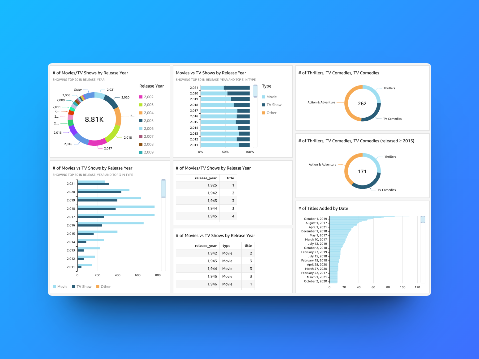
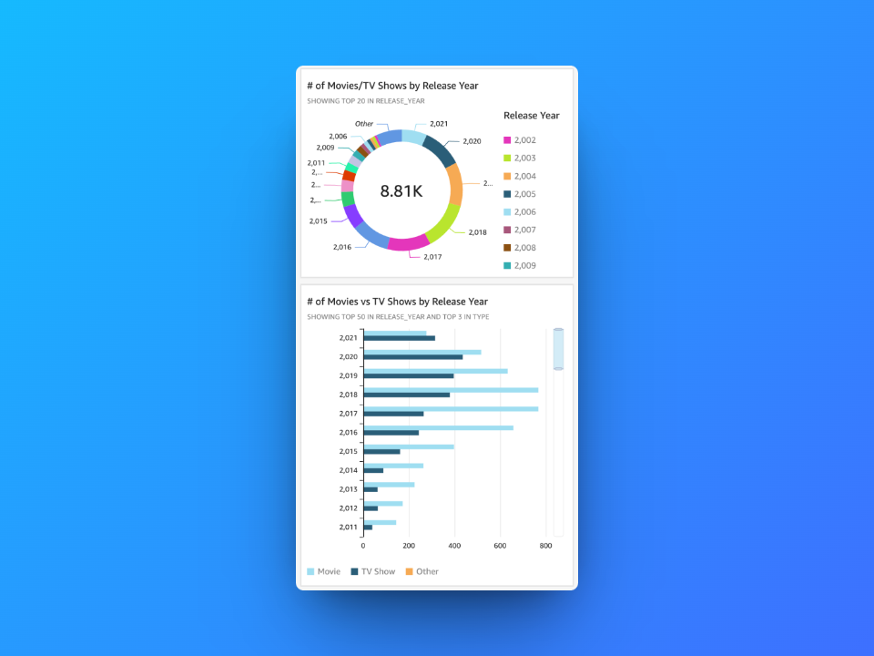
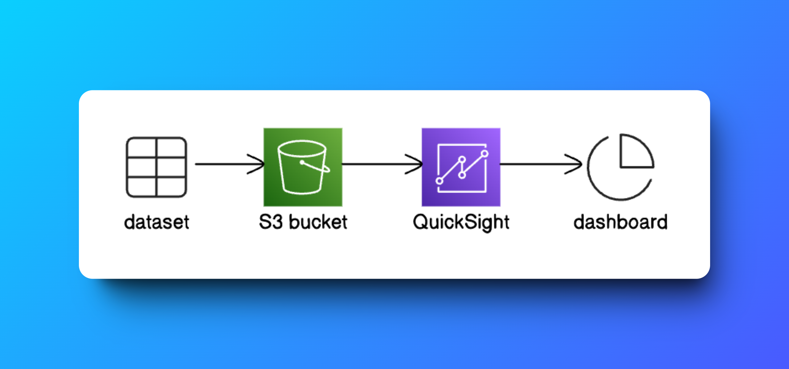

# Visualize Data with Amazon QuickSight

**Dashboard Layout**  

---

## Project Overview

This project demonstrates the process of using Amazon QuickSight, a powerful data visualization tool, to analyze and visualize Netflix's catalog data stored in an S3 bucket. By leveraging QuickSight’s intuitive features, I created an interactive dashboard that reveals insights into Netflix’s release trends, focusing on the distribution of movies and TV shows by release year and type.

---

## Key Deliverables

1. **Dataset Upload**:
   - Uploaded `netflix_titles.csv` to an S3 bucket.
   - Edited `manifest.json` to point QuickSight to the dataset, ensuring proper interpretation and smooth integration.

2. **Account Setup**:
   - Created a QuickSight account and connected it to the S3 bucket.
   - Disabled paid features like Paginated Reports to keep the project within budget.

3. **Visualizations**:
   - Built interactive bar and pie charts to visualize trends by year and type of content (movies vs. TV shows).
   - Applied filters to narrow down the dataset to titles released after 2015 for a more targeted analysis.

4. **Dashboard**:
   - Customized and arranged the visualizations into a user-friendly dashboard.
   - Exported the dashboard as a PDF for easy sharing and presentation.

---

## Challenges and Lessons Learned

- **Challenge**: One of the primary challenges was ensuring that the `manifest.json` file correctly referenced the S3 dataset and allowed QuickSight to access it seamlessly.
- **Lesson Learned**: QuickSight’s drag-and-drop interface for creating visualizations makes the process accessible even for beginners. However, it was important to understand the dataset's structure and how QuickSight interprets it to avoid errors during the visualization setup.

---

## Outcome

- Created a fully interactive dashboard highlighting Netflix’s release trends, focusing on data from 2015 onward. The dashboard shows key patterns in content releases by type and year, which can inform business decisions related to content strategy.
- Exported the final dashboard as a PDF to allow for easy sharing with stakeholders or inclusion in presentations.

---

## Tools and Technologies Used

- **Amazon S3**: Used for storing the Netflix dataset and `manifest.json`.
- **Amazon QuickSight**: The primary tool for visualizing the dataset and creating the interactive dashboard.
- **Manifest JSON**: Ensured proper integration between the dataset in S3 and QuickSight.
- **Data Visualization Techniques**: Utilized bar and pie charts, along with filters, to extract meaningful insights.

---

## Steps to Reproduce

1. **Upload Dataset to S3**:
   - Store `netflix_titles.csv` in an S3 bucket and upload it.
   - Create and edit the `manifest.json` file to include the correct S3 URL to the dataset.

2. **Set Up QuickSight**:
   - Sign up for a free Amazon QuickSight account.
   - Link QuickSight to the S3 bucket containing the dataset.

3. **Create Visualizations**:
   - Use QuickSight’s drag-and-drop interface to create visualizations. For example:
     - Build bar charts to show the count of movies vs. TV shows by year.
     - Use pie charts to break down the genre distribution.
     - Apply filters to focus on more recent data (2015+).

4. **Export Dashboard**:
   - Customize and review the dashboard for clarity.
   - Export the dashboard as a PDF to share insights with others.

---

## Screenshots

1. **Visualization: Netflix Titles by Release Year**  
   

2. **Data Flow**  
   

---

## Community and Contribution

This project was created as part of the **NextWork** [Website](https://link.nextwork.org/app?utm_source=app&utm_medium=nav&utm_campaign=referral) community.  
The main contributor to this project is **Natasha Ong** [LinkedIn](https://www.linkedin.com/in/natasha-ong)
.  
Thank you for your support and guidance throughout this journey!

---

## Author

**Hassan Gachoka**  
[LinkedIn](https://linkedin.com/in/gachokahassan)

---
